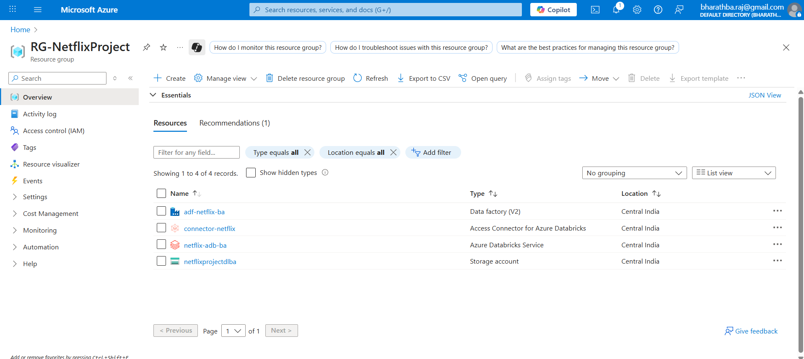
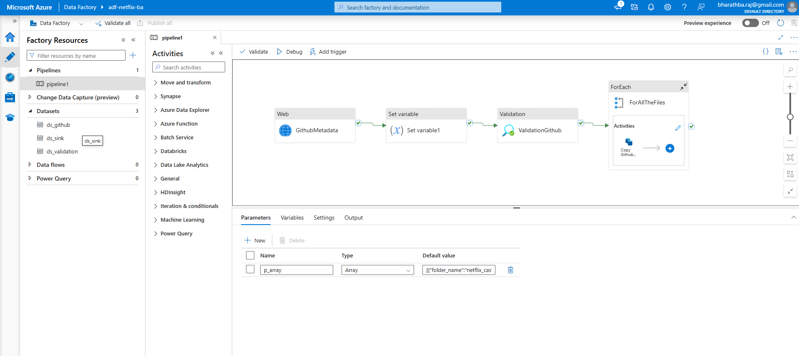
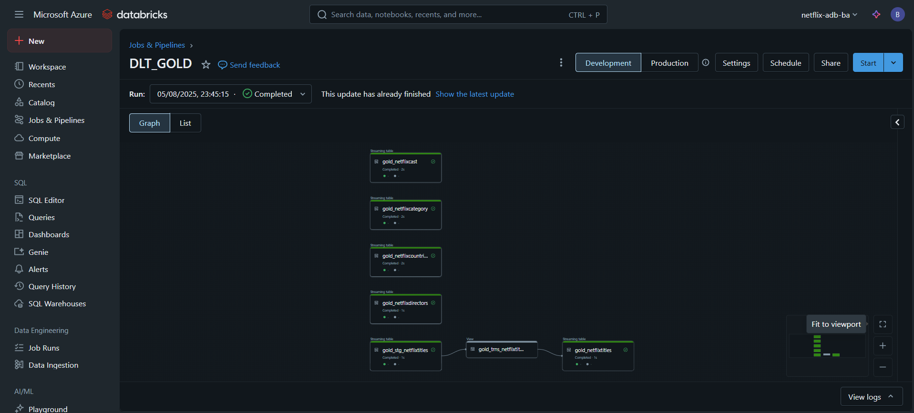

Of course. Here is a `README.md` file based on the second set of images you provided.

---

# End-to-End Data Engineering with Netflix Data on Azure

This repository outlines an end-to-end data engineering project built on the Azure cloud platform. The pipeline ingests the Netflix dataset from a public source, processes it using a modern data stack, and transforms it into a queryable format for analytics.

The solution leverages Azure Data Factory for orchestration, Azure Data Lake Storage Gen2 for scalable storage, and Azure Databricks for high-performance data transformation.

## Table of Contents
- [Architecture](#architecture)
- [Azure Resources](#azure-resources)
- [Pipeline Implementation](#pipeline-implementation)
  - [1. Data Ingestion with Azure Data Factory](#1-data-ingestion-with-azure-data-factory)
  - [2. Data Storage with Azure Data Lake Gen2](#2-data-storage-with-azure-data-lake-gen2)
  - [3. Data Transformation with Databricks Delta Live Tables](#3-data-transformation-with-databricks-delta-live-tables)
- [Outcome](#outcome)

## Architecture

The project follows a modern data pipeline architecture:

1.  **Orchestration & Ingestion**: Azure Data Factory (ADF) orchestrates the entire workflow. A dynamic ADF pipeline fetches metadata from a GitHub repository and copies multiple dataset files into the raw layer of the data lake.
2.  **Storage**: Azure Data Lake Storage (ADLS) Gen2 is used as the central data lake, employing a multi-layered Medallion architecture (Raw, Bronze, Silver, Gold) to logically separate data at different stages of refinement.
3.  **Transformation**: Azure Databricks, specifically using a Delta Live Tables (DLT) pipeline, reads the raw data and performs a series of transformations to clean, model, and aggregate it into curated Gold-layer tables ready for consumption.

## Azure Resources

All resources for this project are managed under the `RG-NetflixProject` resource group in Azure.

*   **Azure Data Factory (`adf-netflix-ba`)**: Used to build and orchestrate the data ingestion pipeline.
*   **Azure Databricks Service (`netflix-adb-ba`)**: The core analytics engine used for data transformation with Delta Live Tables.
*   **Storage Account (`netflixprojectdlba`)**: The ADLS Gen2 data lake that stores the dataset across all layers.
*   **Access Connector for Azure Databricks (`connector-netflix`)**: Provides a managed identity for securely connecting Azure Databricks to the storage account.

## Pipeline Implementation

### 1. Data Ingestion with Azure Data Factory

A single, dynamic pipeline named `pipeline1` in Azure Data Factory handles the entire ingestion process.

*   **Linked Services**: The pipeline uses two main linked services:
    *   `github_con`: An HTTP connection to the source data repository.
    *   `datalake_con`: A connection to the ADLS Gen2 sink.
*   **Pipeline Logic**:
    1.  A **Web** activity fetches a list of files or metadata from the GitHub source.
    2.  A **ForEach** loop iterates through an array parameter containing the names of the datasets to be processed.
    3.  Inside the loop, a **Copy data** activity dynamically copies each file from GitHub into the data lake.

### 2. Data Storage with Azure Data Lake Gen2

The `netflixprojectdlba` storage account is structured with multiple containers to support the Medallion architecture:

*   **`raw`**: The landing zone for data ingested directly from the source by ADF.
*   **`bronze`**: Stores the raw data converted into the efficient Delta Lake format.
*   **`silver`**: Contains cleaned, filtered, and standardized data.
*   **`gold`**: Holds the final, aggregated, business-ready tables for analytics and reporting.
*   **`metastore`**: Used by Databricks for managing table metadata.

### 3. Data Transformation with Databricks Delta Live Tables

The core transformation logic is encapsulated in a Delta Live Tables (DLT) pipeline named `DLT_GOLD`.

*   **Declarative ETL**: The pipeline defines the data flow from Bronze to Gold layers declaratively.
*   **Data Quality & Lineage**: DLT automatically manages dependencies between datasets, tracks data lineage, and allows for defining data quality expectations.
*   **Gold Layer Creation**: The DLT pipeline processes the raw/bronze data and generates multiple curated streaming tables in the Gold layer, including:
    *   `gold_netflixcategory`
    *   `gold_netflixdirectors`
    *   `gold_netflixaccount...`
    *   And others, as defined in the pipeline graph.

## Outcome

The result of this pipeline is a set of analysis-ready, high-quality tables in the **Gold** layer of the data lake. This curated data can be easily connected to BI tools like Power BI, used for advanced analytics, or served for machine learning workloads, providing valuable insights from the Netflix dataset.